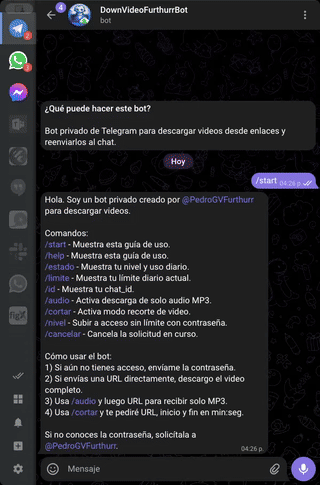

# Bot privado de Telegram para descargar video/audio

Bot privado en Python que descarga contenido desde URLs con `yt-dlp`, permite recorte con `ffmpeg`, envia el archivo por Telegram y registra actividad en SQLite.

## Demo



## Que hace este proyecto

- Descarga video completo desde URL.
- Descarga solo audio en MP3.
- Recorta un video por rango de tiempo (`inicio` y `fin`).
- Controla acceso por lista blanca (`ALLOWED_CHAT_IDS`) o por contrasena.
- Limita uso diario para usuarios no root.
- Limita concurrencia de descargas para evitar saturacion.
- Elimina temporales al finalizar cada proceso.

## Casos de uso

- Quieres un bot personal/privado para bajar videos o audio.
- Quieres compartir el bot con pocas personas con control de acceso.
- Quieres mantener un historial local de tareas en SQLite.

## Stack

- Python 3.11+
- `python-telegram-bot`
- `yt-dlp`
- `ffmpeg` (instalado en el sistema)
- SQLite (`aiosqlite`)

## Tutorial desde cero (instalacion completa)

### 0) Clonar el repositorio

```bash
git clone https://github.com/furthurr/BotDownloadVideoTelegram
cd BotDownloadVideoTelegram
```

### 1) Crear entorno virtual

```bash
python3 -m venv venv
source venv/bin/activate
```

### 2) Instalar dependencias

```bash
pip install -r requirements.txt
```

### 3) Verificar `ffmpeg`

```bash
ffmpeg -version
```

Si no esta instalado, instalalo y vuelve a ejecutar el comando anterior.

### 4) Crear archivo de configuracion

```bash
cp .env.example .env
```

Edita `.env` y configura al menos estos valores:

- `TELEGRAM_BOT_TOKEN`: token real de BotFather.
- `ALLOWED_CHAT_IDS`: ids separados por coma (ejemplo: `123456789,987654321`).
- `ACCESS_PASSWORD`: contrasena para acceso limitado.
- `ACCESS_ROOT_PASSWORD`: contrasena para acceso sin limite diario.

Puedes dejar los demas valores por defecto al inicio.

### 5) Crear directorios locales

```bash
mkdir -p data tmp/files
```

### 6) Iniciar el bot

```bash
python app/main.py
```

Si todo esta bien, el bot empezara a escuchar mensajes en Telegram.

## Primer uso en Telegram

1. Abre Telegram y busca tu bot.
2. Escribe `/start`.
3. Si tu `chat_id` esta en `ALLOWED_CHAT_IDS`, ya tienes acceso.
4. Si no, envia `ACCESS_PASSWORD` o `ACCESS_ROOT_PASSWORD` en un mensaje.
5. Prueba una URL directa o usa comandos:
   - `/audio <url>` para MP3.
   - `/cortar <url> 1:20 2:45` para recorte.

## Comandos disponibles

- `/start` o `/help`: guia principal.
- `/estado`: estado de acceso y uso diario.
- `/limite`: limite diario y reinicio.
- `/id`: muestra tu `chat_id`.
- `/nivel`: solicita elevacion a root por contrasena.
- `/audio`: flujo interactivo para MP3.
- `/cortar`: flujo interactivo para recorte.
- `/cancelar`: cancela flujo activo.

## Configuracion (`.env`) recomendada

- `SQLITE_DB_PATH=data/bot.db`
- `TEMP_DOWNLOAD_DIR=tmp/files`
- `MAX_FILE_SIZE_MB=50`
- `MAX_CONCURRENT_DOWNLOADS=1`
- `DOWNLOAD_TIMEOUT_SECONDS=300`

## Validacion rapida

```bash
python -m compileall app
python app/main.py
```

## Estructura del proyecto

- `app/main.py`: arranque y registro de handlers.
- `app/bot.py`: flujos de Telegram, permisos y limites.
- `app/downloader.py`: descarga, conversion y recorte.
- `app/database.py`: inicializacion y consultas SQLite.
- `app/config.py`: lectura de variables de entorno.
- `sql/init.sql`: esquema base de tablas.

## Seguridad para repo publico

- Nunca subas `.env`.
- Nunca subas `data/bot.db`.
- No compartas `TELEGRAM_BOT_TOKEN` ni contrasenas.
- Si un token se expuso, rotalo en BotFather.

## Documentacion adicional

Para alcance funcional y decisiones MVP, revisa `docs/PROJECT_SPEC.md`.
